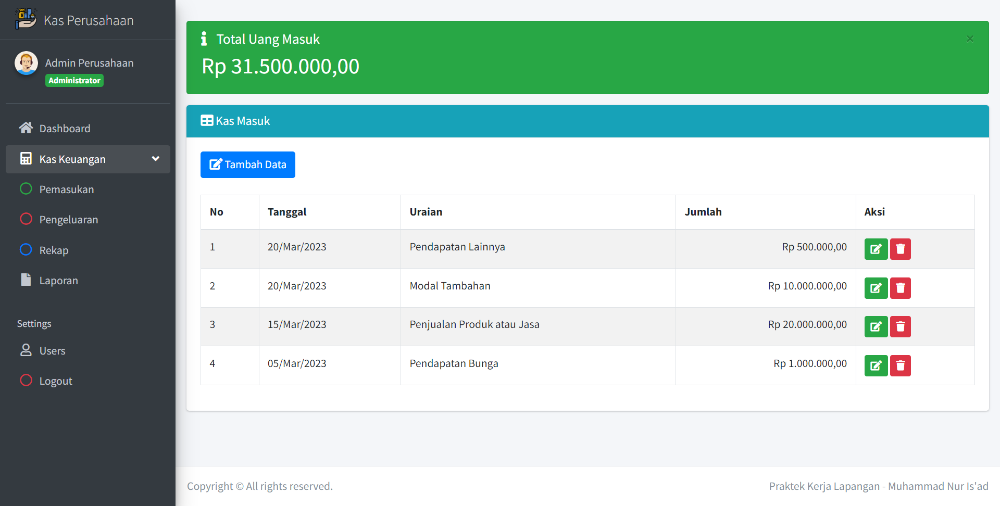
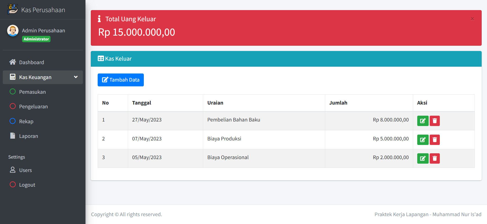
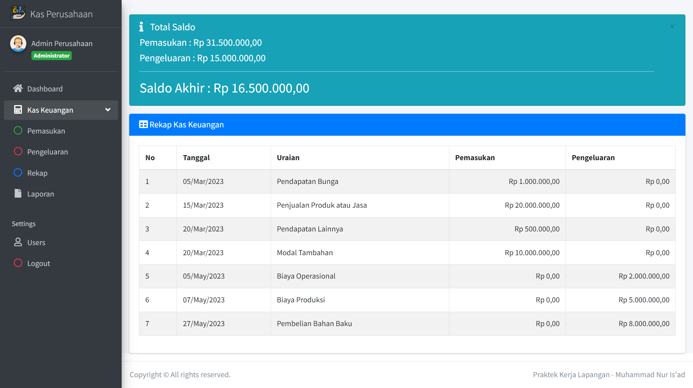

# Kas Perusahaan

Aplikasi ini bertujuan untuk mengelola pemasukan, pengeluaran, rekap, dan laporan keuangan di perusahaan. Dengan menggunakan aplikasi ini, perusahaan dapat secara efisien mencatat dan melacak semua transaksi keuangan yang terjadi.

## Tampilan Aplikasi

## Anggota Kelompok

| No | Nama               | NIM      |
|----|--------------------|----------|
| 1  | Muhammad Dava      | 202051011       |
| 2  | Saka Perdana W. S. | 202051168       |
| 3  | Alham Manazil      | 202051170       |
| 4  | Muhammad Nur Is’ad | 202051179       |
| 5  | Aditya Bagus S.    | 202051202       |

## Fitur

- Pencatatan Pemasukan: Aplikasi ini memungkinkan pengguna untuk mencatat setiap pemasukan yang diterima oleh perusahaan. Pengguna dapat memasukkan rincian pemasukan, seperti tanggal, sumber pemasukan, dan jumlahnya.

- Pencatatan Pengeluaran: Selain pemasukan, aplikasi ini juga memungkinkan pengguna untuk mencatat setiap pengeluaran yang dilakukan oleh perusahaan. Pengguna dapat memasukkan rincian pengeluaran, seperti tanggal, tujuan pengeluaran, dan jumlahnya.

- Rekap Keuangan: Aplikasi ini dapat menyajikan rekapitulasi keuangan perusahaan berdasarkan pemasukan dan pengeluaran yang telah dicatat. Pengguna dapat melihat ringkasan keuangan yang mencakup total pemasukan, total pengeluaran, dan saldo akhir.

- Laporan Keuangan: Aplikasi ini dapat menghasilkan laporan keuangan yang lengkap, seperti laporan laba rugi, neraca, dan arus kas. Laporan-laporan ini memberikan gambaran yang jelas tentang kesehatan keuangan perusahaan.

## Cara Menggunakan

1. Pastikan Anda telah menginstal XAMPP dan menjalankan layanan Apache dan MySQL. Anda dapat menghidupkan kedua layanan ini melalui kontrol panel XAMPP.

2. Buka browser dan akses alamat `http://localhost/phpmyadmin` untuk membuka phpMyAdmin.

3. Di phpMyAdmin, buatlah sebuah database baru dengan nama "keuangan".

4. Setelah database dibuat, pilih database "keuangan" di sidebar phpMyAdmin.

5. Pada halaman database "keuangan", pilih tab "Import" di bagian atas.

6. Klik tombol "Choose File" dan pilih file yang berada di dalam folder database dengan nama `keuangan.sql`.

7. Klik tombol "Go" untuk mengimpor file SQL ke dalam database "kas_perusahaan".

8. Setelah proses impor selesai, buka browser dan akses alamat `http://localhost/kas_perusahaan` untuk membuka aplikasi "kas_perusahaan".

9. Anda akan diarahkan ke halaman login. Masukkan username "admin" dan password "admin" untuk masuk ke dalam aplikasi (ingatlah untuk mengubah kata sandi ini ke yang lebih aman dalam pengaturan aplikasi nanti).

Sekarang Anda dapat menggunakan aplikasi "kas_perusahaan" secara lokal di XAMPP. Pastikan untuk melakukan langkah-langkah ini hanya di lingkungan pengembangan lokal Anda.

Sekian, Penjelasan dari aplikasi kami.
